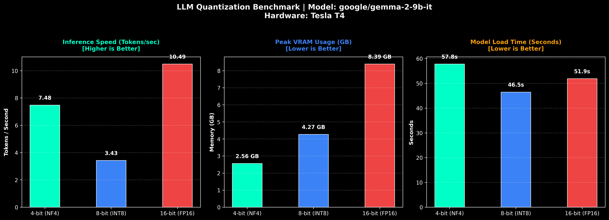

# llm-quant-bench

Automated LLM quantization benchmarking engine and VRAM profiler for PyTorch and Hugging Face Transformers.

`llm-quant-bench` evaluates **4-bit (NF4)**, **8-bit (INT8)**, and **16-bit (FP16)** precisions on NVIDIA GPUs. It profiles generation speed (tokens/sec), peak VRAM memory footprint, and model loading latency, then exports a high-resolution dark-mode dashboard.

---

## Benchmark Results (`google/gemma-2-9b-it` on Tesla T4)



### Performance Matrix

| Precision Variant | Status | Generation Speed | Peak VRAM | Model VRAM | Load Time |
| :--- | :--- | :--- | :--- | :--- | :--- |
| **4-bit (NF4)** | `SUCCESS` | **7.48 tok/s** | **2.56 GB** | 2.48 GB | 57.79s |
| **8-bit (INT8)** | `SUCCESS` | **3.43 tok/s** | **4.27 GB** | 4.12 GB | 46.47s |
| **16-bit (FP16)** | `SUCCESS` | **10.49 tok/s** | **8.39 GB** | 8.36 GB | 51.89s |

---

## Hardware Takeaways

1. **FP16 Delivers Maximum Throughput (10.49 tok/s):** Native FP16 Tensor Core execution avoids runtime dequantization overhead, providing highest token speed when VRAM (~8.4 GB) allows.
2. **NF4 (4-bit) Optimizes VRAM Efficiency (2.56 GB):** Cuts memory footprint by **~69.5%** compared to FP16, enabling execution on low-VRAM GPUs with minimal speed penalty (~28%).
3. **INT8 Bottlenecks on Turing Architecture (3.43 tok/s):** Dynamic vector-wise dequantization overhead on Tesla T4 causes INT8 to run significantly slower than native FP16.

---

## Core Features

* **Silent Dependency Management:** Dynamically verifies and installs compatible `transformers`, `bitsandbytes`, and `accelerate` packages without breaking pre-installed environment packages.
* **Gated Model Auth & Open Fallback:** Resolves `HF_TOKEN` from Kaggle Secrets, Colab Secrets, or environment variables. Automatically falls back to open-access models (`Qwen/Qwen2.5-7B-Instruct`) if authorization fails.
* **Aggressive VRAM Reclamation:** Executes CUDA IPC cache flushes and garbage collection between benchmark passes to eliminate memory leaks and false OOM errors.
* **300 DPI Chart Generation:** Produces a publication-ready visual comparison plot saved directly to `llm_benchmark_gemma2_9b_t4.png`.

---
## License
MIT

## Quickstart

### Prerequisites

* Python 3.10+
* PyTorch with CUDA support
* NVIDIA GPU (T4, P100, V100, A100, H100)

### Execution

Run the script in any terminal, Kaggle Notebook, or Google Colab instance:

```bash
python benchmark.py
